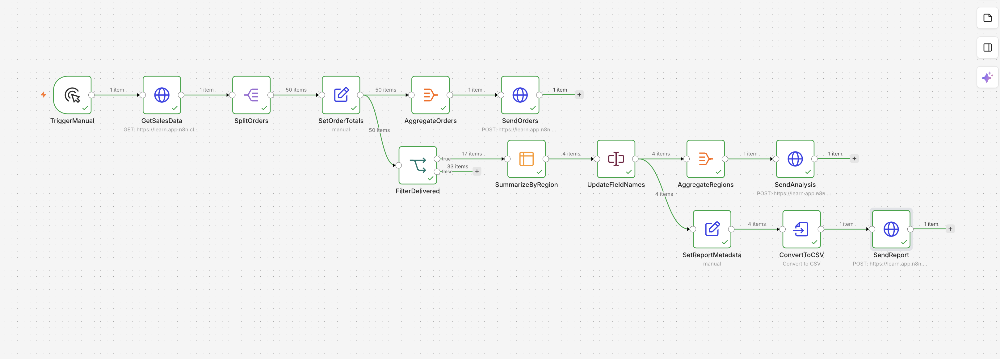
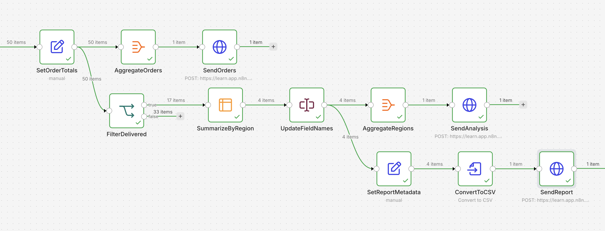
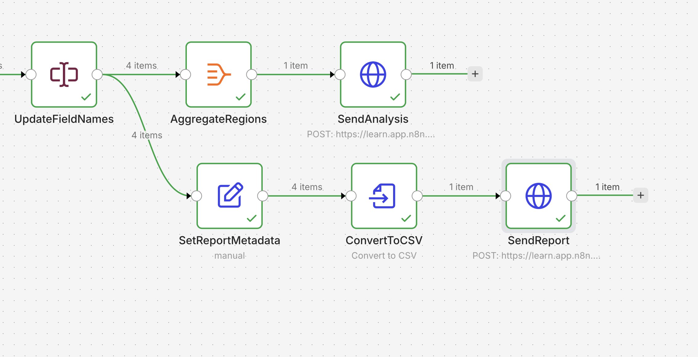
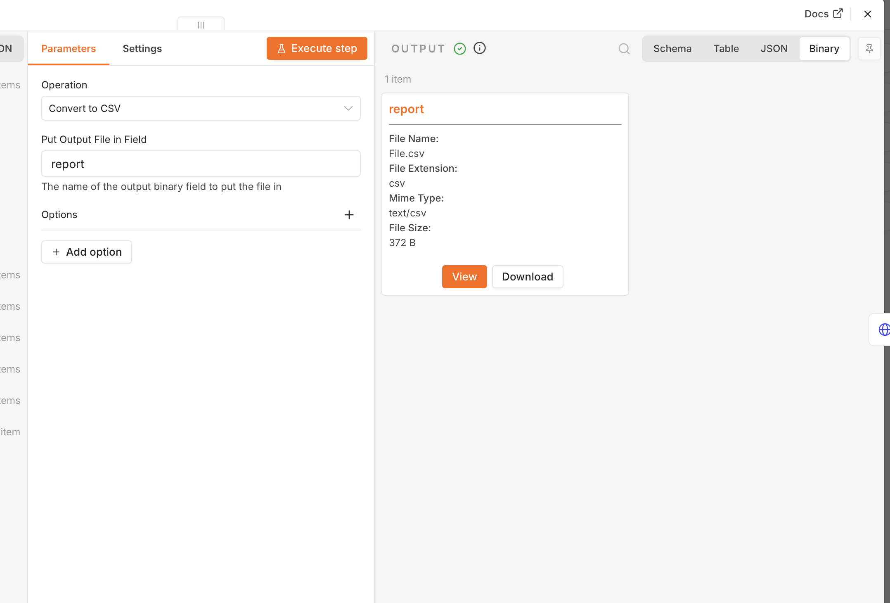

# n8n Sales Data Pipeline

A portfolio project demonstrating an end-to-end sales data processing and reporting workflow built with n8n.

## Overview

This workflow retrieves sales data from an API, transforms and filters the records, calculates order totals, creates regional summaries, and generates a CSV report.

The workflow demonstrates how a single data source can be processed through multiple branches for operational processing, analytics, and reporting.

## Workflow



## What the workflow does

1. Retrieves sales data from an API using an HTTP Request node.
2. Splits an array of orders into individual items.
3. Calculates the total value of each order.
4. Sends all transformed orders to a processing endpoint.
5. Filters delivered orders using an IF node.
6. Summarizes delivered orders by region.
7. Calculates:
   - total revenue by region
   - number of delivered orders
   - average order value
8. Aggregates regional analytics.
9. Creates a CSV report.
10. Sends the generated binary file through an HTTP Request.

## Data Transformation and Branching



The workflow uses branching so that the same transformed sales data can be reused for different purposes:

- operational order processing
- regional sales analysis
- management reporting

## Regional Analysis

Delivered orders are grouped by region and summarized using:

- Sum of `order_total`
- Count of orders
- Average `order_total`

The resulting data is then renamed and aggregated into a structured regional payload.

## Report Generation



The reporting branch adds report metadata and converts the summarized JSON data into a CSV file.

## Binary File Output



The CSV report is stored as binary data in n8n and can then be uploaded, emailed, or sent to another API.

## Key n8n Concepts Used

- HTTP Request
- Header Authentication
- JSON data processing
- Split Out
- Edit Fields
- Expressions
- IF conditions
- Workflow branching
- Summarize
- Aggregate
- Rename Keys
- Convert to File
- Binary data handling
- CSV generation

## Example Architecture

```text
Sales API
   |
   v
Split Orders
   |
   v
Calculate Order Totals
   |
   +--------------------> Aggregate Orders -> Send Orders
   |
   v
Filter Delivered Orders
   |
   v
Summarize by Region
   |
   v
Rename Fields
   |
   +--------------------> Aggregate Regions -> Send Analysis
   |
   v
Add Report Metadata
   |
   v
Convert to CSV
   |
   v
Send Report
```


## Repository Structure

```text
n8n-sales-data-pipeline/
│
├── README.md
├── n8n-sales-data-pipeline-public.json
│
└── screenshots/
    ├── workflow-overview.png
    ├── data-processing-branches.png
    ├── report-generation.png
    └── csv-binary-output.png
```

## Workflow File

The repository includes a sanitized n8n workflow export:
n8n-sales-data-pipeline-public.json
Sensitive credentials and identifiers have been removed from the public version.
Example API endpoints are used in place of private or environment-specific endpoints.

## How to Use

1. Import n8n-sales-data-pipeline-public.json into n8n.
2. Configure your API endpoint.
3. Add your authentication credentials.
4. Replace placeholder authentication values where required.
5. Execute the workflow.

## Skills Demonstrated

This project demonstrates practical experience with:

- workflow automation
- API integration
- data transformation
- conditional logic
- aggregation
- reporting automation
- binary file handling
- structured workflow design

## Project Type

Portfolio / demonstration automation project built with n8n.
